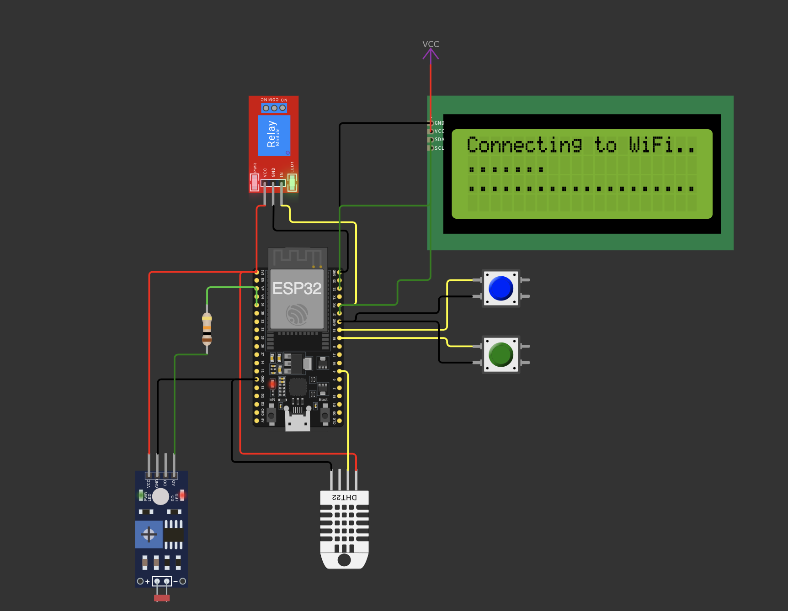

# FIAP - Faculdade de Informática e Administração Paulista

 

## Sistema de Coleta e Comunicação de Dados Usando ESP32 Integrado ao Wi-Fi.

## 📑 Índice 

- [Nome do grupo](#nome-do-grupo)
- [Integrantes](#-integrantes)
- [Professores](#-professores)
  - [Tutor(a)](#tutora)
  - [Coordenador(a)](#coordenadora)
- [Descrição](#-descrição)
  - [Sensores e Funcionalidades](#sensores-e-funcionalidades)
  - [Arquitetura do Sistema](#arquitetura-do-sistema)
  - [Arquitetura do circuito](#arquitetura-do-circuito)
  - [Benefícios para o Agronegócio](#benefícios-para-o-agronegócio)
  - [Tecnologias Utilizadas](#tecnologias-utilizadas)
- [Estrutura de pastas](#-estrutura-de-pastas)
- [Como executar o código](#-como-executar-o-código)
- [Licença](#-licença)

## Nome do grupo
 

## 👨‍🎓 Integrantes: 
- <a href="www.linkedin.com/in/ederson-badeca">Ederson Badeca</a>

## 👩‍🏫 Professores:
### Tutor(a) 
- <a href="https://www.linkedin.com/company/inova-fusca">Leonardo Ruiz Orabona</a>
### Coordenador(a)
- <a href="https://www.linkedin.com/company/inova-fusca">ANDRÉ GODOI CHIOVATO</a>

## 📜 Descrição

O projeto "AgroSense IoT" é um sistema avançado de monitoramento ambiental desenvolvido para otimizar a produção agrícola através da coleta e análise de dados em tempo real. Utilizando a versatilidade do microcontrolador ESP32 em conjunto com sensores especializados, o sistema oferece uma solução completa para o monitoramento de condições críticas em ambientes agrícolas.

### Sensores e Funcionalidades

O sistema integra dois sensores fundamentais para o monitoramento agrícola:

1. **Sensor DHT22** para medição precisa de:
   - Temperatura ambiente (precisão de ±0.5°C)
   - Umidade relativa do ar (precisão de ±2-5%)

2. **Sensor de Umidade do Solo** para:
   - Monitoramento contínuo da umidade do solo
   - Otimização do processo de irrigação
   - Prevenção de desperdício de água

### Arquitetura do Sistema

A solução implementa uma arquitetura IoT moderna e eficiente:

1. **Camada de Aquisição de Dados:**
   - ESP32 como unidade central de processamento
   - Sensores conectados através de portas GPIO
   - Leituras periódicas configuráveis

2. **Comunicação e Conectividade:**
   - Conexão Wi-Fi para transmissão de dados
   - Protocolo MQTT para comunicação em tempo real
   - Integração com a plataforma Ubidots para visualização e análise

3. **Interface e Visualização:**
   - Dashboard interativo na plataforma Ubidots
   - Gráficos em tempo real das medições
   - Sistema de alertas configuráveis

### Arquitetura do circuito

### Benefícios para o Agronegócio

O sistema oferece vantagens significativas para o setor agrícola:

- **Otimização de Recursos:** Redução no consumo de água e energia através do monitoramento preciso
- **Tomada de Decisão:** Dados em tempo real para decisões mais assertivas
- **Automação:** Possibilidade de integração com sistemas de irrigação automatizados
- **Sustentabilidade:** Uso mais eficiente dos recursos naturais
- **Produtividade:** Aumento da produção através do monitoramento constante

### Tecnologias Utilizadas

O projeto utiliza um conjunto robusto de tecnologias:

- **Hardware:** ESP32 e sensores de alta precisão
- **Linguagem:** C++ com framework Arduino
- **Protocolo:** MQTT para comunicação em tempo real
- **Plataforma:** Ubidots para visualização e análise de dados
- **Conectividade:** Wi-Fi para transmissão de dados

Esta solução representa um avanço significativo na aplicação de tecnologia IoT no agronegócio, oferecendo uma ferramenta poderosa para o monitoramento e otimização da produção agrícola. O sistema é escalável, permitindo a adição de novos sensores e funcionalidades conforme as necessidades específicas de cada implementação.

## 📁 Estrutura de pastas

Dentre os arquivos e pastas presentes na raiz do projeto, definem-se:

- <b>.github</b>: Nesta pasta ficarão os arquivos de configuração específicos do GitHub que ajudam a gerenciar e automatizar processos no repositório.

- <b>assets</b>: aqui estão os arquivos relacionados a elementos não-estruturados deste repositório, como imagens.

- <b>config</b>: Posicione aqui arquivos de configuração que são usados para definir parâmetros e ajustes do projeto.

- <b>document</b>: aqui estão todos os documentos do projeto que as atividades poderão pedir. Na subpasta "other", adicione documentos complementares e menos importantes.

- <b>scripts</b>: Posicione aqui scripts auxiliares para tarefas específicas do seu projeto. Exemplo: deploy, migrações de banco de dados, backups.

- <b>src</b>: Todo o código fonte criado para o desenvolvimento do projeto ao longo das 7 fases.

- <b>README.md</b>: arquivo que serve como guia e explicação geral sobre o projeto (o mesmo que você está lendo agora).

## 🔧 Como executar o código

 Por favor visite o documento [como executar o código](./src/readme.md)

## 📋 Licença

<a property="dct:title" rel="cc:attributionURL" href="https://github.com/agodoi/template">MODELO GIT FIAP</a> por <a rel="cc:attributionURL dct:creator" property="cc:attributionName" href="https://fiap.com.br">Fiap</a> está licenciado sobre <a href="http://creativecommons.org/licenses/by/4.0/?ref=chooser-v1" target="_blank" rel="license noopener noreferrer" style="display:inline-block;">Attribution 4.0 International</a>.

